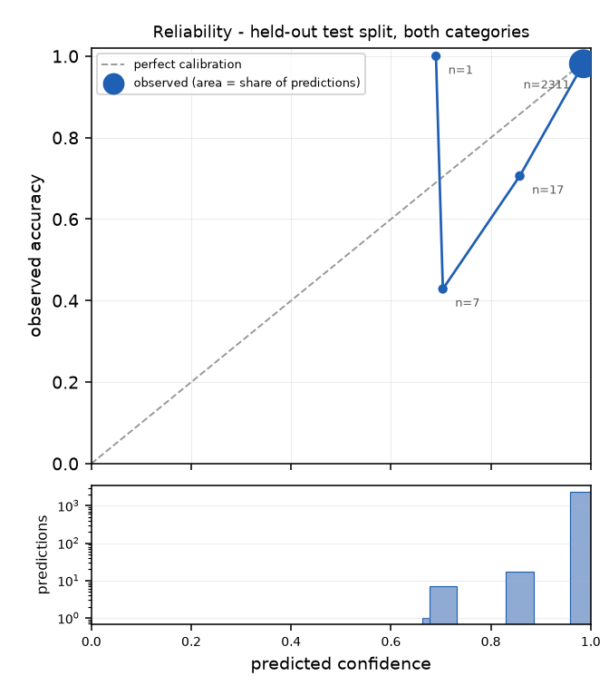
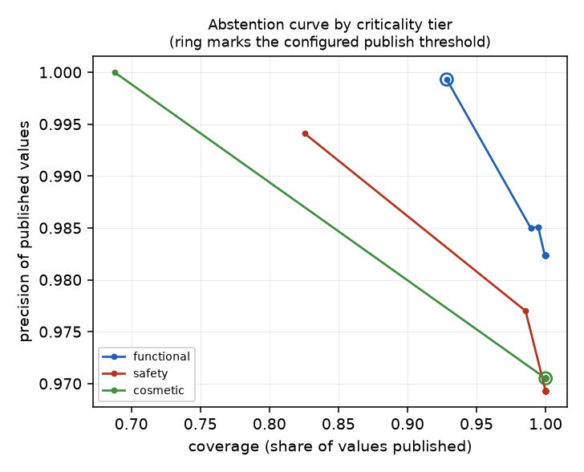

# Results

Generated 2026-08-23 by `python -m sourced.eval.report`. Every number below is produced by that command from the held-out test split, and the split is fixed at corpus-generation time.

## Read this first — what the corpus is

The evaluation runs on a **generated corpus**, not on distributor API data. Digi-Key and Mouser keys require interactive registration (doc 05) and none was available, so the corpus is synthesised by `sourced/corpus/build.py`: datasheets and catalogue pages with ruled tables, distributor listings that carry realistic error rates, sibling parts, conflicting revisions, and sparse SKU rows derived from them.

This changes what the numbers mean, in both directions:

- **Labels have no noise by construction.** Doc 04 asks for a measured label-noise rate; here it is structurally zero, which is a property of the corpus rather than a result. On distributor silver labels it would not be.
- **The documents are digital, ruled, and consistent in style.** Real datasheets include borderless tables, scans, and multi-column layouts. Table extraction here is easier than in production.
- **The failure modes the system claims to handle are present and adversarially placed.** Sibling-part traps, cross-source conflicts and contradicting listings are in the corpus by construction, so the gates are genuinely exercised rather than assumed.

Treat the precision and coverage figures as an upper bound, and the wrong-part, conflict, routing and calibration behaviour as the load-bearing results.

## Dataset

|  |  |
|---|---|
| Verticals | electrical_connector · pipe_fitting |
| SKUs (total) | 656 |
| SKUs (held-out test) | 207 |
| Source documents | 138 datasheets and catalogue pages, 471 distributor/marketplace listings |
| Labels | synthetic_generator_ground_truth |
| Label noise | 0% by construction (see above) |
| Attributes per category | {"electrical_connector": 16, "pipe_fitting": 14} |
| Taxonomy leaves | 73 |
| Splits | dev 252 · calibration 197 · test 207 |
| LLM tier in this run | **off** — measured separately below |
| LLM provider configured | `featherless` |

Two categories share one corpus, one source index, one taxonomy and one pipeline. Doc 02 claims attribute sets are data rather than separate pipelines; carrying a second vertical is what tests that claim.

| category | SKUs | attributes | what it contributes |
|---|---|---|---|
| `electrical_connector` | 373 | 16 | datasheet tables, per-part ordering rows, tight numeric tolerances |
| `pipe_fitting` | 283 | 14 | abbreviation soup (`1/2IN X 3/4IN BRS 90 ELL FIP 150#`), fractional inches, ordered end pairs, pressure-class lookups |

Cohorts, across both categories:

| cohort | n | what it tests |
|---|---|---|
| normal | 302 | ordinary extraction from a manufacturer document |
| contradicted | 32 | a listing contradicts the manufacturer document — authority must win |
| conflict | 46 | two manufacturer documents disagree — abstention, not a vote |
| distributor_only | 184 | the part is absent from the manufacturer document but listed by a distributor, so the only evidence is low-authority |
| sibling_trap | 92 | **only the sibling's document exists — correct answer is `no_source_located`** |

## Headline, both categories

| metric | value |
|---|---|
| Source location rate | 100.0% |
| Precision (published values) | 99.6% over 1897 values |
| Precision — safety tier | 100.0% (n=286) |
| Precision — functional tier | 99.9% (n=1374) |
| Precision — cosmetic tier | 97.0% (n=237) |
| Recall (labelled attributes the system filled) | 85.7% |
| **Auto-publish rate at the per-tier thresholds** | 76.9% |
| Expected Calibration Error | 0.0059 |
| **Schema routing accuracy** | 100.0% |
| Wrong-part traps refused | 24/24 (leak rate 0.0%) |
| Error taxonomy | {"wrong_value": 8} |

## Per category

| category | source located | coverage | precision | recall | auto-publish | unit uniformity | ECE |
|---|---|---|---|---|---|---|---|
| `electrical_connector` | 100.0% | 74.1% | 99.4% | 78.0% | 72.3% | 100.0% | 0.0103 |
| `pipe_fitting` | 100.0% | 90.0% | 99.9% | 98.6% | 84.7% | 100.0% | 0.0009 |

Coverage is against each category's own merchandising checklist, so the two columns are not directly comparable — `pipe_fitting` scores higher partly because more of its required attributes are recoverable from the sparse row itself.

Consistency, per category:

| category | unit uniformity | family coherence flags /1k | coverage variance within family |
|---|---|---|---|
| `electrical_connector` | 100.0% | 0.00 | 0.273 |
| `pipe_fitting` | 100.0% | 0.00 | 0.000 |

## Category routing

With one populated category the classifier cannot be wrong in a way that matters. With two it can send a record to an attribute set that does not describe the part, which is worse than sending it nowhere.

| metric | value |
|---|---|
| Records routed | 207 |
| **Schema routing accuracy** | 100.0% |
| Records assigned a taxonomy code | 207 |
| **Invented codes** | 0 |

Confusion, expected against chosen:

| expected | chose `electrical_connector` | chose `pipe_fitting` | chose none |
|---|---|---|---|
| `electrical_connector` | 119 | 0 | 0 |
| `pipe_fitting` | 0 | 88 | 0 |

Routing is decided by counting, not by similarity: the abbreviations in the row decode to attribute keys, and each key belongs to one schema. `ELL` decodes to `form_factor` and `SMD` to `mounting_type`, so the vote is auditable and the reason is recorded in the assignment's `method` field. The taxonomy leaf is still chosen by retrieval, and the hard existence check still makes an invented code structurally impossible.

## Validation and enrichment

| metric | value |
|---|---|
| **Auto-publish rate** | 76.9% |
| Abstention rate | 14.3% |
| False abstention rate (correct values withheld) | 51.6% |
| Escalation load (attributes needing review per SKU) | 1.04 |
| Injected-fabrication interception | 100.0% |

The false-abstention rate counts values that were extracted correctly and withheld anyway. At 51.6% it is high, and the reason is visible below: `sources_conflict` abstentions are cases where two manufacturer documents disagree and one of them happens to be right. The system cannot tell which without a human, so it withholds both — the cost of ADR-004 stated in the direction that is unflattering.

Abstentions by reason:

| code | count |
|---|---|
| below_threshold | 218 |
| not_in_source | 117 |
| sources_conflict | 13 |
| failed_validation | 5 |

Publish thresholds (doc 03 §5): safety 0.99, functional 0.95, cosmetic 0.85. Safety-tier values additionally require two independent sources.

## Scalable catalog engine

| metric | value |
|---|---|
| Throughput | 4415.8 SKUs/min (single process, warm document cache) |
| LLM calls per SKU | 0.00 |
| **LLM avoidance rate** | 100.0% |
| Attributes by winning tier | {"rule": 80.0, "table": 2256.0, "llm": 0.0} |
| Candidates rejected by span containment | 0.0 |
| Re-verification cost vs a full re-run | 7.2% |

Cost per 1,000 SKUs: **$0.00 measured** — with the LLM tier disabled no tokens were spent. Attributes by winning tier counts only the candidate that won adjudication, so the rules tier looks small there; what it actually contributes is the `no_rules_tier` ablation below.

Source-revision handling: revising `fam000_ds` touched 5 of 5 linked products and 80 attributes, against 1104 in a full re-run of that category.

## Calibration

| metric | value |
|---|---|
| Expected Calibration Error (all tiers, both categories) | 0.0059 |
| ECE by criticality | {"functional": 0.0052, "safety": 0.0136, "cosmetic": 0.0008} |
| ECE by category | {"electrical_connector": 0.0103, "pipe_fitting": 0.0009} |
| Predictions scored | 2336 |
| Fitted groups | cosmetic, electrical_connector|cosmetic, electrical_connector|functional, electrical_connector|safety, functional, pipe_fitting|functional, pipe_fitting|safety, safety |

Confidence is fitted per **(category, criticality tier)**, not per tier alone. Doc 03 specifies the tier; with two categories in the catalogue that is under-specified, and fitting one model across both cost the stronger category roughly twenty points of auto-publish rate before this was corrected. The tier remains the policy boundary — it is what sets the threshold — while the category is what makes the fit honest. A group with too few labelled rows falls back to the tier alone, then to the observed base rate.

Reliability, bucketed:

| bin | n | mean confidence | observed accuracy |
|---|---|---|---|
| 0.6-0.7 | 1 | 0.690 | 1.000 |
| 0.7-0.8 | 7 | 0.704 | 0.429 |
| 0.8-0.9 | 17 | 0.858 | 0.706 |
| 0.9-1.0 | 2311 | 0.985 | 0.981 |

Largest fitted coefficients, `electrical_connector|cosmetic`: `close_call` -0.63, `locator_structured_field` -0.62, `locator_table_cell` +0.61, `source_authority` +0.56, `agreement_count` +0.34.
Largest fitted coefficients, `electrical_connector|functional`: `agreement_count` +2.36, `locator_structured_field` -1.55, `close_call` -1.44, `locator_table_cell` +1.24, `source_authority` +1.05.
Largest fitted coefficients, `electrical_connector|safety`: `locator_structured_field` -1.03, `locator_table_cell` +1.03, `source_authority` +0.87, `agreement_count` +0.65, `close_call` -0.50.
Largest fitted coefficients, `pipe_fitting|functional`: `agreement_count` +0.69, `locator_structured_field` -0.61, `locator_table_cell` +0.48, `source_authority` +0.43, `tier_table` -0.13.
Largest fitted coefficients, `pipe_fitting|safety`: `close_call` -0.93, `locator_structured_field` -0.40, `locator_table_cell` +0.40, `source_authority` +0.29, `agreement_count` +0.21.

## Ablations

Each row is the full pipeline with one component removed, re-run on the same held-out split, for each category.

**`electrical_connector`**

| variant | precision | auto-publish | coverage | wrong-part leak | ECE |
|---|---|---|---|---|---|
| `full_system` | 99.4% | 72.3% | 74.1% | 0.0% | 0.0103 |
| `no_source_verification` | 92.1% | 66.9% | 69.0% | 100.0% | 0.1129 |
| `no_span_containment` | 99.4% | 72.3% | 74.1% | 0.0% | 0.0103 |
| `no_relational_validation_l2` | 99.4% | 72.3% | 74.1% | 0.0% | 0.0103 |
| `no_family_coherence_l3` | 99.4% | 72.3% | 74.1% | 0.0% | 0.0103 |
| `no_rules_tier` | 99.3% | 66.7% | 61.9% | 0.0% | 0.0081 |
| `no_tables_tier` | 100.0% | 27.4% | 60.6% | 0.0% | 0.0090 |
| `uncalibrated_confidence` | 100.0% | 54.0% | 54.0% | 0.0% | 0.0412 |
| `with_mpn_decoding` | 99.4% | 72.6% | 74.1% | 0.0% | 0.0104 |

**`pipe_fitting`**

| variant | precision | auto-publish | coverage | wrong-part leak | ECE |
|---|---|---|---|---|---|
| `full_system` | 99.9% | 84.7% | 90.0% | 0.0% | 0.0009 |
| `no_source_verification` | 98.4% | 91.8% | 90.6% | 100.0% | 0.0250 |
| `no_span_containment` | 99.9% | 84.7% | 90.0% | 0.0% | 0.0009 |
| `no_relational_validation_l2` | 99.9% | 85.1% | 90.7% | 0.0% | 0.0009 |
| `no_family_coherence_l3` | 99.9% | 84.7% | 90.0% | 0.0% | 0.0009 |
| `no_rules_tier` | 99.9% | 75.9% | 76.2% | 0.0% | 0.0014 |
| `no_tables_tier` | 100.0% | 49.1% | 60.6% | 0.0% | 0.0066 |
| `uncalibrated_confidence` | 100.0% | 54.1% | 51.8% | 0.0% | 0.0758 |
| `with_mpn_decoding` | 99.9% | 84.7% | 90.0% | 0.0% | 0.0009 |

### What the ablations show, including where they show nothing

- **Source verification is the load-bearing component.** Removing it leaks every wrong-part trap (leak rate 100.0%) and costs 7.3 points of precision. Nothing else in the table moves precision like it.
- **The rules tier earns its place in both verticals, and by a similar margin.** Removing it costs 12.3 coverage points on connectors and 13.8 on fittings. Doc 05 predicted the deterministic tier would do markedly *more* work in the abbreviation-soup vertical; on this corpus it does not, because the fitting catalogues carry the same attributes in their tables. A real fittings catalogue is sparser than the generated one, so this is a limitation of the corpus rather than a refutation of the claim — but the claim is not supported by these numbers and is reported that way.
- **The tables tier matters more to fittings than to connectors.** Removing it costs 13.6 coverage points on connectors and 29.4 on fittings — the opposite of the expectation above, and worth stating plainly.
- **Calibration buys coverage, not precision.** Replacing the fitted model with a hand-set score keeps precision at or above the full system's while publishing materially less, which is the whole argument for ADR-005: an uncalibrated threshold is not wrong so much as uninformative.

Three variants move nothing, and that is reported rather than hidden:

- `no_span_containment` is identical to the full system **because the LLM tier is disabled in this run**. The rules and tables tiers build their span from the text they just read, so the containment check can never fail for them. This row measures nothing; it should not be read as the gate being useless.
- `no_relational_validation_l2` and `no_family_coherence_l3` move nothing on **uncorrupted** data, which is the expected result: there are no contradictory pairs and no family outliers to find when extraction is correct. Their value appears in the injected-fabrication test below, where L3 catches 23.3% and L2 6.2% of corruptions independently.
- `with_mpn_decoding` barely moves, consistent with doc 06 placing it fifth on the cut list. It stays off by default.

## Adversarial and robustness

**Injected fabrication.** 176 known-correct published values were corrupted with plausible-but-wrong substitutes — a sibling part's value, a unit swap, an adjacent enum, an out-of-range number — and the validation stack was re-run over each.

| metric | value |
|---|---|
| Corruptions injected | 176 |
| Intercepted by at least one level | 176 |
| Interception rate | 100.0% |

Each level is asked independently rather than stopping at the first one that fires, so the shares below overlap and do not sum to 100%. A first-match-wins attribution credits Level 1 with everything and makes Levels 2 and 3 look inert, which would be a reporting artefact rather than a finding.

| level | caught | share of corruptions | what it sees |
|---|---|---|---|
| L1 per-attribute | 176 | 100.0% | type, enum, unit, range, and whether the value is still readable out of the span it cites |
| L2 relational | 11 | 6.2% | pairs of individually plausible values that cannot both be true |
| L3 family coherence | 41 | 23.3% | outliers against sibling SKUs — the only level that addresses consistency |
| Publish threshold | 44 | 25.0% | calibrated confidence falling below the criticality tier's bar |

Level 1 catches everything here because the span check binds the value to the text it was read from: a corrupted value no longer parses out of its own cited cell. That is the cheapest gate doing the heaviest work, which is ADR-006's claim. On real documents, where a value can be read correctly from the wrong row, L1 would not have this advantage.

**Wrong-part robustness.** The held-out split contains 24 SKUs across both categories whose own document is absent while a sibling part's is present and scores well on every soft signal. Correct behaviour is `no_source_located`.

| metric | value |
|---|---|
| Traps in the held-out split | 24 |
| Correctly refused | 24 |
| **Leak rate** | 0.0% |

**Degraded input.** The same SKUs re-run with fields removed or damaged.

`truncated_mpn` locating nothing is the intended behaviour, not a regression: a part number missing its last characters is a *different* identifier, and matching it against the longer part it prefixes is exactly the sibling-part failure ADR-002 exists to prevent. Refusing is correct; an earlier substring implementation silently matched.

| variant | source location rate | published values | mean confidence |
|---|---|---|---|
| `baseline` | 100.0% | 536 | 0.996 |
| `no_manufacturer` | 100.0% | 536 | 0.996 |
| `no_description` | 100.0% | 536 | 0.995 |
| `malformed_mpn` | 100.0% | 536 | 0.996 |
| `truncated_mpn` | 0.0% | 0 | n/a |

## The LLM tier, measured

Every number above comes from a run with the model tier **off**. This section is the tier switched on, as a paired A/B over the same 40 held-out SKUs (22 electrical_connector, 18 pipe_fitting).

|  |  |
|---|---|
| Provider | `api.featherless.ai:mistralai/Mistral-Nemo-Instruct-2407` |
| Model | `mistralai/Mistral-Nemo-Instruct-2407` (open weights, 12B) |
| Self-consistency samples | 1 |
| Sample | 40 SKUs from the held-out test split |

It is a separate section, not folded into the headline, for three reasons: it ran on a sample rather than the full split, the provider is not the one doc 03 specifies, and its latency makes it a different kind of system to operate. Reporting it as one number with the deterministic run would hide all three.

### What the tier contributes

| metric | value |
|---|---|
| Attributes added that no deterministic tier reached | 5 |
| Attributes added per SKU | 0.12 |
| SKUs the tier changed nothing on | 35 of 40 |
| Of those added, published | 5 |
| Precision of added values | 100.0% |
| Which attributes | {"rohs_compliant": 3, "nominal_size_secondary": 2} |

The tier fills exactly the gaps the design predicted it would: values stated in prose rather than in a table. `rohs_compliant` lives in a sentence ("All parts in this series are RoHS compliant"), and no table-row extractor will ever find it. It is a small contribution because the deterministic tiers already resolve most of the schema -- which is the intended shape, not a disappointment.

### What the gates threw away

This is the number ADR-006 rests on, and it could not be measured until the tier ran.

| funnel stage | remaining | removed here |
|---|---|---|
| Attributes requested across all calls | 87 |  |
| Proposals the model returned | 44 |  |
| after: cited chunk id must exist | 37 | 7 |
| after: cited span must appear in that chunk | 20 | 17 |
| after: cited span must yield the claimed value | 5 | 15 |
| **Reached the record** | 5 |  |
| **Total rejection rate** | 88.6% |  |

**38.6% of proposals cited a span that is not in the chunk they cited.** The check that catches them is a Python `in` test. It costs nothing, runs before any model-based review, and is the single most productive component in the system.

A second gate had to be added because of what this run exposed. Span containment alone passed `nominal_size_secondary = 1 in` citing the span `"3/4 in"` — a real span, a fabricated pairing, on a fitting with no secondary size at all. It published at 0.99 confidence. Requiring the cited text to actually **yield** the claimed value caught it, and 15 others in this sample. That hole was open for as long as the tier went unexercised.

### The same SKUs with the gates removed

`no_span_containment` was a null row in the ablation table for as long as the tier was disabled. It is not null any more.

| metric | gates on | gates off |
|---|---|---|
| LLM values reaching the record | 5 | 15 |
| Precision of values reaching the record | 100.0% | 33.3% |
| Of those, published after calibration | 5 | 5 |
| Precision of published values | 100.0% | 80.0% |
| Values invented for attributes the part does not have | 0 | 8 |

Two independent defences, and the table separates them. The gates take the model from 33.3% to 100.0% on values entering the record. Calibrated confidence then filters again, which is why the ungated arm still reaches 80.0% on what it publishes — worse than the gated arm, but not catastrophic. Neither layer is sufficient alone, which is the argument for having both.

### Cost and latency

| metric | value |
|---|---|
| Calls made | 72 |
| Prompt tokens per SKU | 3448 |
| Completion tokens | 11943 |
| Wall seconds per SKU | 34.0 |
| Responses the model returned unparseable | 42 of 72 |
| Provider retries / failures | 1 / 0 |

At 34.0 seconds per SKU the tier is three orders of magnitude slower than the deterministic path, which processes thousands of SKUs a minute. That is the trade doc 03 anticipates when it insists on one call per SKU for unresolved attributes only, and it is why LLM avoidance is a reported metric rather than an implementation detail.

42 of 72 responses could not be parsed into a tool payload at all. This model also returns its tool call as text inside `content`, wrapped in `[[{...}]]`, rather than in `tool_calls`. Both are tolerated: the parser tries the trustworthy envelope first and falls back, and nothing downstream trusts the result regardless.

## The generated description, measured

Doc 07 lists risk R8: the description is the only generative surface, so it is the only place fabrication can re-enter after every extraction gate. Doc 08 (ADR-013) claims three defences — generation sees only published attributes, each claim is aligned to the attribute that licensed it, and untraceable spans are stripped.

That had never been tested against a model. The composed fallback runs when no provider is configured, and its traceability is exact by construction, which proves nothing.

**The audit is deliberately independent of the pipeline's own alignment.** Asking `_align_claims` to grade itself would be circular, so the check is external and blunt: every number in the finished copy must be accounted for by a published attribute value or by a verbatim occurrence of the part's own identifiers. 20 descriptions from the held-out split, each generated and separately composed for control.

### What the measurement found

Before the fix, on the same sample:

|  | generated | composed control |
|---|---|---|
| Descriptions carrying a number nothing licenses | **7 of 20 (35%)** | 0 |
| Claims the pipeline itself reported as untraceable | 0 | 0 |

The second row is the finding. The pipeline's own defence reported everything as traceable, because alignment works a sentence at a time: a fabricated number rides along inside a sentence that also cites a real attribute. "It is rated for Class 150 service, with 9A current" is marked traceable on the strength of `Class 150`, and carries an invented current rating with it.

The seven failures were not what the risk register anticipated:

| failure mode | count | example |
|---|---|---|
| **Rewritten part number** | 6 | `WM413-N050` written as `WM413-1050`; `B10B-VH12-A-GR` as `B10B-12` |
| Invented specification | 1 | `9A current` on a record that published no current rating |

The commoner failure is the more damaging one. An invented specification is wrong; a rewritten part number in catalogue copy is an ordering error, and the system prompt already told the model not to restate the part number.

### The fix, and what it costs

Stripping untraceable claims is not sufficient, so the numeric licence check became a hard gate in the same spirit as ADR-006: copy carrying a number nothing licenses is not published, and the deterministic composition ships instead — it cannot invent one.

| metric | value |
|---|---|
| Descriptions audited | 20 |
| **Carrying an unlicensed number, after the gate** | **0** (0.0%) |
| Rejected by the gate, falling back to composed | 6 |
| Claims left untraceable | 0 |
| Claims citing an unpublished attribute | 0 |
| Every claim's offsets address its own span | yes |
| Mean length, generated vs composed | 246 vs 281 characters |
| Seconds per description | 9.2 |

The cost is stated rather than hidden: 6 of 20 descriptions are now the composed form rather than the generated one. That is the trade ADR-013 implies but does not name — a generative surface can only be kept if something deterministic is ready to replace its output.

A smaller defect surfaced alongside it: `_align_claims` stored a stripped sentence against unstripped match bounds, so `description[span_start:span_end]` returned text one character out and the UI's hover highlight sat off by a space. The composed path was correct, which is why it only appeared once a model wrote the copy.

## Known limitations

- **The corpus is synthetic.** Labels are the generator's ground truth, so the label-noise rate doc 04 asks for is zero by construction rather than measured. Precision and coverage on real distributor data would be lower.
- **The headline numbers come from a run with the LLM tier off.** The tier is now measured, but separately and on a 40-SKU sample rather than the full split, because inference costs 9-80 seconds a call against a contended endpoint. The 100% LLM-avoidance figure therefore describes the deterministic run; the tier's own contribution, gates and cost are in their own section above, with their own sample size.
- **The model measured is not the model specified.** Doc 03 designs around an Anthropic tool call with prefix caching; what was available was an OpenAI-compatible endpoint serving open weights, and the model measured is a 12B one that failed to return a parseable tool payload on 44 of 72 calls. A stronger model would propose better values -- and would still be filtered by the same gates. The Anthropic path is implemented and unexercised.
- **Prefix caching, doc 03's main cost lever, is unmeasured.** The endpoint reported zero cached tokens on every call. The Anthropic path sets `cache_control` explicitly; the OpenAI-compatible path has no equivalent and none was invented.
- **The LLM sample is small.** Four attributes added and 41 proposals judged is enough to show the gates working and not enough to put a tight interval on the precision of what survives. The rejection rates are the robust part; `precision of added values = 100%` rests on four values.
- **Dense retrieval is TF-IDF + SVD, not sentence-transformers.** ADR-007's hybrid shape and lexical dominance are preserved, but the semantic half is weaker than the document specifies. Swapping it means replacing one class.
- **The taxonomy is internal.** UNSPSC and ETIM tables require a licensed or registered download. `sourced/taxonomy/index.py` imports either if the CSV is placed in `data/`; the retrieve-then-constrain mechanism and the hard code validation are unchanged either way.
- **Category classification is retriever-only in this run.** The model-based constrain step is implemented and switched off by default: it would fire on every record, and decoded-key voting already routes at 100%. The hard existence check still runs, so an invented code remains impossible. The method actually used is recorded in each assignment's `method` field.
- **Generated descriptions are measured on 20 SKUs, and the headline run still composes them.** Generation stays opt-in (`llm_description`): it costs a call per record, and on this model roughly a third of its output fails the licence gate and falls back to the composed form anyway. The gate is a numeric check, so a fabricated *word* -- an invented certification with no number in it, say `IP-rated` or `UL listed` -- would not be caught by it. That gap is real and unmeasured.
- **Two categories, not a catalogue.** The registry is exercised by two populated schemas sharing one pipeline, which is what makes the schema-as-data claim testable, but seventy-one of the seventy-three taxonomy leaves still have no attribute set behind them. Routing accuracy is measured over a two-way choice and would not survive being read as a seventy-three-way one.
- **Routing is decided by decoded-key votes, which depend on the lexicon.** A row whose abbreviations are absent from the lexicon falls back to leaf retrieval, and a vertical with no lexicon coverage at all would route by similarity alone. The fallback order is recorded in each assignment's `method` field rather than hidden.
- **Throughput is not a production figure.** It is measured single-process with a warm document cache, so it reflects steady-state re-processing rather than a cold first pass over a new corpus. No queue or worker pool is implemented; doc 01 names Redis and `arq`, and neither was needed at this scale.
- **The reported numbers came from the SQLite path.** The Postgres path is verified separately: `docker compose up` builds the corpus, runs this evaluation and loads 373 products with 5,136 provenance rows into Postgres, with the GIN and family indexes in place, and re-running it leaves the count unchanged. Two bugs only Postgres could surface were found that way and fixed -- a UUID/VARCHAR column mismatch, and an insert ordering that SQLite accepted because it does not enforce foreign keys by default. SQLite now enforces them too.
