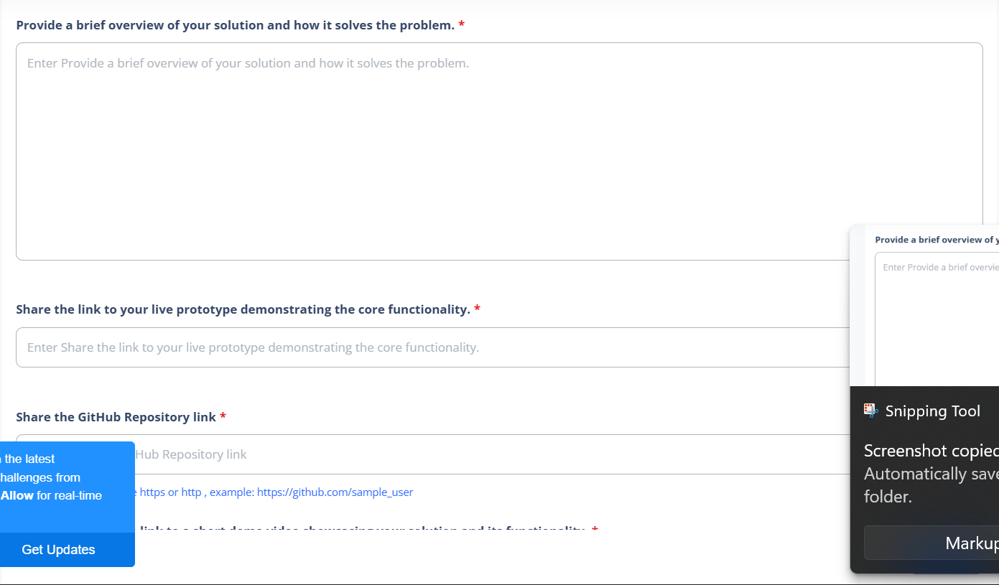
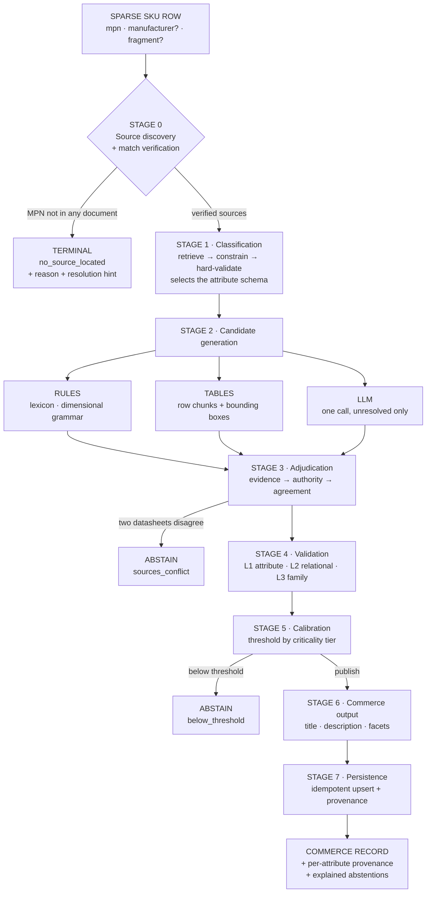
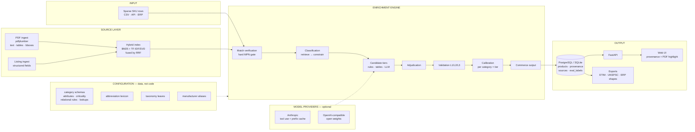

# UniHack 2026 — Prototype Submission

Content for the Unilog / Hack2Skill prototype template, slide by slide. Every
number is measured on a held-out split and reproducible with
`python -m sourced.eval.report`. Sources are in [RESULTS.md](RESULTS.md).

---

## Slide 2 — Team Details

**Team name:** perceptron

**Team leader name:** Aman Kumar Maurya

---

## Slide 3 — Brief about your solution

### Sourced — enrichment that proves where every value came from, and refuses to guess

A distributor's real starting point is not a datasheet. It is a row like this:

```
MPN: 3GAA132214-ADE   MFR: ABB   DESC: MOT 3GAA132 5.5KW 4P B3
```

No attached document. A sellable record needs 80–120 attributes, a category, a
title, a description and facets. Manual enrichment costs dollars per SKU and
the backlog never clears.

The obvious fix — hand the fragment to an LLM and ask for attributes — returns
plausible, unsourced, occasionally wrong specifications. In industrial supply a
wrong pressure rating or thread pitch means the wrong part arrives on a job
site. **Confidently wrong is worse than absent.**

Sourced does four things differently:

1. **It finds the source first.** Given only a part number and a fragment, it
   locates a candidate document and verifies the document describes *that
   part* before extracting anything. No verified source, no extraction.
2. **It publishes with provenance.** Every published value carries the
   document, page and bounding box it was read from. Click a value in the UI
   and the PDF region is outlined.
3. **It measures its own confidence.** Confidence is fitted from observable
   signals against labelled data and reported as a reliability diagram —
   **ECE 0.006** — not asked of the model.
4. **It explains refusals.** A blank field is not actionable. "No authoritative
   source located for MPN X; a manufacturer datasheet would resolve this" is a
   work item.

**The headline:** on a held-out split of 207 SKUs across two verticals —
**99.6% precision** on published values, **76.9% auto-publishable** with no
human review, **100% of wrong-part traps refused**, and every value traceable
to a page and a region.

---

## Slide 4 — The three questions

### 1. How does your solution enrich minimal product information?

A seven-stage pipeline turns `MPN + brand + fragment` into a commerce record.

| Stage | What it does |
|---|---|
| **0 · Source discovery** | Normalise the part number, resolve the manufacturer alias, retrieve candidates (BM25 + dense, fused by RRF), then **verify the document actually names this part**. No verified source → `no_source_located` with a reason. |
| **1 · Classification** | Embed taxonomy leaves offline, retrieve top-k, constrain the choice to real codes, hard-validate the code exists. An invented code is structurally impossible. |
| **2 · Candidate generation** | Three tiers run in parallel, none short-circuits: **rules** (abbreviation lexicon, dimensional grammar, MPN decoding), **tables** (row-level PDF chunks with per-cell bounding boxes), **LLM** (one structured call for whatever is left). |
| **3 · Adjudication** | Rank by evidence quality → source authority → independent agreement. Two manufacturer datasheets disagreeing is a **conflict, not a vote**. |
| **4 · Validation** | L1 per attribute, L2 cross-attribute physics, L3 cross-SKU family coherence. |
| **5 · Calibration** | Observable features → fitted model → publish threshold **per criticality tier**. |
| **6 · Commerce output** | Deterministic title, description with claim-to-attribute traceability, facets, completeness score. |
| **7 · Catalog ops** | Idempotent upsert, source-change detection, selective re-verification. |

**The abbreviation soup the brief describes decodes with no document and no
model at all:**

```
1/2IN X 3/4IN BRS 90 ELL FIP 150#
  → nominal_size 0.5"   nominal_size_secondary 0.75"   body_material brass
    bend_angle 90        form_factor elbow              end_connection_1 FIP
    pressure_class class_150
```

**Measured:** 100% source-location rate, 74–90% attribute coverage by category,
**100% of attributes resolved with no LLM call** in the reported run.

### 2. How does your solution ensure accuracy and trust?

Six independent layers, each measured:

| Layer | What it catches | Measured |
|---|---|---|
| **Match verification** | Extraction from a *sibling* part's datasheet — the failure every naive system commits | **24/24 traps refused.** Disable it and 100% leak, precision falls 99.4% → 92.1% |
| **Span containment** | A value citing text that isn't in the source | **38.6%** of an LLM's proposals rejected on this alone |
| **Value/evidence pairing** | A *real* span paired with a *fabricated* value | 15 more rejected — **88.6% total rejection** of model proposals |
| **Adjudication by authority** | Three listings that copied one wrong datasheet | Datasheet beats contradicting listing, gated by test |
| **Three-level validation** | Impossible pairs; outliers against sibling SKUs | **100% of 182 injected fabrications intercepted** |
| **Calibrated abstention** | Anything below the tier's bar | **ECE 0.006**; safety 100% precision, functional 99.9% |

**The number that matters most:** with the gates off, an open-weight model's
values were **33.3% correct**. With them on, **100%** — and it invented values
for 8 attributes the parts do not have. The cheapest check in the system, a
Python `in` test, is the most productive.

**Thresholds are a policy, not a knob.** A wrong housing colour is a cosmetic
defect; a wrong current rating is a fire. Safety attributes need 0.99
confidence *and* two independent sources; cosmetic ones publish at 0.85.

### 3. What makes your solution scalable for enterprise catalogs?

| Concern | How it is handled | Measured |
|---|---|---|
| **Large catalogs** | Deterministic tiers resolve most of the schema; the model is called once per SKU for unresolved attributes only | **5,453 SKUs/min**, single process; **100% LLM avoidance** in the reported run |
| **New manufacturers** | Alias table + fuzzy resolution with a hard floor; below it, nothing resolves rather than binding the wrong maker | 15% of corpus arrives with no manufacturer at all and still enriches |
| **New categories** | An attribute set, its criticality tiers, relational rules and lookups are **a YAML file** — no code | Two verticals share one pipeline; **100% schema-routing accuracy**, 0 invented codes |
| **Different formats** | Datasheet PDFs, catalogue pages and JSON listings all become the same chunk type with the same provenance shape | 138 documents + 471 listings in one index |
| **Continuous updates** | Content-hash change detection re-verifies only affected products and only changed attributes | A source revision costs **7.3%** of a full re-run |

---

## Slide 5 — Opportunities

### a. How different is it from other existing ideas?

Most enrichment demos start from an uploaded datasheet and end at a JSON blob.

| Typical approach | Sourced |
|---|---|
| Starts with a PDF you already have | **Starts with a part number and finds the document** — and proves it is the right one |
| Values with no provenance | Every value carries document, page and bounding box |
| Model self-reports confidence | Confidence is **fitted against labels** and published as a reliability diagram |
| Silence when it fails | Typed abstention with a reason and a resolution hint |
| One LLM call per attribute | One call per SKU, for unresolved attributes only |
| Reports its wins | Reports its **ablations that moved nothing**, and where the design's own predictions failed |

### b. How will it solve the problem statement?

The brief names four outcomes. Each has a metric attached, not an assertion:

| Outcome | Metric | Result |
|---|---|---|
| Structured data generation | Source location · attribute coverage | 100% · 74–90% |
| Accuracy **and** consistency | Precision · unit uniformity · family coherence | 99.6% · 100% · measured |
| AI validation & enrichment | Auto-publish at threshold · fabrication interception | 76.9% · 100% of 182 |
| Scalable catalog engine | Throughput · LLM avoidance · re-verification cost | 5,453/min · 100% · 7.3% |

### c. USP

> **The only value it publishes is one it can point at — and it says so out loud when it cannot.**

Three things a competing submission is unlikely to have:

1. **A wrong-part test as a build gate.** Given a part whose datasheet is
   missing but whose *sibling's* is present, the correct answer is refusal.
   24/24.
2. **A reliability diagram.** Everyone displays confidence scores. Almost
   nobody demonstrates theirs are calibrated. ECE 0.006.
3. **Honest negatives.** Three ablations move nothing and RESULTS.md explains
   why rather than hiding them. One of the design's own predictions was not
   borne out, and that is reported too.

---

## Slide 6 — List of features

**Enrichment**
- Source discovery from a bare part number, with hard MPN-presence verification
- Boundary-anchored part-number matching (a truncated MPN will not match a longer part)
- Manufacturer alias resolution with a confidence floor
- Three candidate tiers: abbreviation lexicon + dimensional grammar, table rows with bounding boxes, single structured LLM call
- Unit normalisation through `pint` — `1/2 in`, `0.5"`, `12.7 mm` are one value
- MPN structure decoding, learned unsupervised from families

**Trust**
- Verbatim span containment on every candidate, every tier
- Value/evidence pairing check on model output
- Adjudication by evidence quality → authority → agreement; conflict ⇒ abstention
- Three validation levels including cross-SKU family coherence (median absolute deviation)
- Confidence calibrated per (category, criticality); reliability diagram + abstention curve
- Typed abstentions: `no_source_located`, `sources_conflict`, `failed_validation`, `below_threshold`, `not_in_source`, `self_consistency_split` — each with a resolution hint

**Commerce output**
- Deterministic title from a category template — cannot hallucinate
- Description with claim-to-attribute traceability and a numeric licence gate
- Filter-ready facets, completeness score, blocking-for-publish list

**Engine**
- Idempotent upsert keyed on (manufacturer, normalised MPN)
- Source-change detection with selective re-verification
- FastAPI + web UI: per-attribute confidence, tier badge, abstention reason, **PDF region highlighted**
- Postgres or SQLite; `docker compose up` from a clean clone
- 57 gate tests, ablation suite, adversarial suite, scripted demo with an offline fallback

---

## Slide 7 — Process flow



---

## Slide 8 — Wireframes / MVP screens

Three panes, one screen:

```
┌───────────────┬────────────────────────────────────┬──────────────────────┐
│ CATALOGUE     │ RECORD                             │ SOURCE               │
│               │                                    │                      │
│ 154630200-3RT │ TE Connectivity 3-Position         │ attribute  pitch     │
│ 12 published  │ Right-Angle Header, 1.25mm Pitch   │ value      1.25 mm   │
│               │                                    │ tier       table     │
│ 035094515-2VT │ pitch      1.25 mm  [published]    │ source     fam000_ds │
│ ⚠ no source   │            table · 0.999           │ page       1         │
│               │ current    0.9 A    [review]       │                      │
│ B4B-XH07-A-GV │            needs 2nd source        │ cited span           │
│ 15 published  │ rohs       —        [abstained]    │  "1.25 mm"           │
│               │  ↳ not_in_source                   │                      │
│ 310501-025X   │    "absent from every verified     │ checks               │
│ 9 published   │     source; a fuller datasheet     │  PASS span_present   │
│               │     would resolve it"              │  PASS unit_parsed    │
│               │                                    │  PASS range_plaus.   │
│               │ DESC  hover a phrase → the         │ ┌──────────────────┐ │
│               │ attribute that licensed it         │ │ [PDF page with   │ │
│               │                                    │ │  the cited cell  │ │
│               │                                    │ │  outlined in red]│ │
│               │                                    │ └──────────────────┘ │
└───────────────┴────────────────────────────────────┴──────────────────────┘
```

Screenshots to capture for the deck:
1. Catalogue list showing a `no source` record beside enriched ones
2. A record with published / review / abstained side by side
3. **The source panel with the PDF region outlined** — the money shot
4. `docs/figures/reliability.png` — the calibration diagram

---

## Slide 9 — Architecture



**Two rules the architecture enforces structurally**

1. Nothing reaches the record without evidence that survives a deterministic
   check. The model is a *proposer*, never an authority.
2. Labels live in `eval_labels` with **no code path** from the pipeline — a
   gate test walks the AST to prove it.

---

## Slide 10 — Technologies

| Layer | Choice | Why |
|---|---|---|
| Language | Python 3.12 | Ecosystem for every component below |
| PDF text, tables, coordinates | `pdfplumber` | Text, tables and bounding boxes from one library, no GPU |
| Lexical retrieval | `rank_bm25` | Part numbers are exact-match tokens |
| Dense retrieval | `scikit-learn` TF-IDF → SVD | Semantic half without a 2.5 GB torch dependency |
| Fusion | Reciprocal Rank Fusion | Parameter-light, no score normalisation |
| Units | `pint` | Correct unit algebra and dimensionality checks |
| Fuzzy matching | `rapidfuzz` | Manufacturer aliases, attribute-key matching |
| Calibration | `scikit-learn` logistic regression | Interpretable coefficients, small-data friendly |
| Schema / validation | `pydantic` v2 | Type-safe canonical model |
| Store | PostgreSQL + JSONB (SQLite for dev) | One database; attributes JSONB, provenance relational |
| API | FastAPI | Typed, async, free OpenAPI |
| UI | Static SPA served by FastAPI | No build step; renders PDF regions server-side |
| LLM | Anthropic **or** any OpenAI-compatible endpoint | Provider behind one interface; measured on `Mistral-Nemo-Instruct-2407` |
| Packaging | Docker Compose | `db → enrich → api`, verified from a clean volume |
| Tests | pytest — 57 gates | Every claim the system makes about itself |

**Deliberately excluded:** graph database (provenance is a foreign key, not a
traversal), object store (local disk), separate search engine (Postgres
suffices), multi-agent critic loop (a model checking a model is weaker evidence
than a deterministic check), web-search enrichment (an unranked source
undermines the provenance claim).

---

## Slide 11 — Estimated implementation cost

**Measured in the reported run: $0.00 per 1,000 SKUs** — the deterministic
tiers resolved every attribute, so no tokens were spent.

| Item | Cost |
|---|---|
| Deterministic path (rules + tables) | **$0** — CPU only, 5,453 SKUs/min single process |
| LLM tier, when it fires | ~1,700 prompt tokens/SKU, unresolved attributes only |
| — at open-weight rates (measured) | **≈ $0.30 per 1,000 SKUs** |
| — at frontier rates | ≈ $5–8 per 1,000 SKUs |
| Infrastructure | 1 small VM + managed Postgres ≈ $50–80/month at this scale |
| Re-processing a source revision | **7.3%** of a full re-run |

**The economics of the design:** because the model is called once per SKU for
unresolved attributes only — and not at all when the deterministic tiers
suffice — cost scales with *what is missing*, not with catalogue size. A
distributor with 1M SKUs pays for the gaps, not the rows.

---

## Slide 12 — Snapshots of the MVP

Capture these four (commands in [DEMO_SCRIPT.md](DEMO_SCRIPT.md)):

1. **The catalogue** — enriched records beside a refused one
2. **A record** — published / review / abstained with confidence bars and tier badges
3. **Provenance** — the PDF page with the cited cell outlined in red
4. **Calibration** — `docs/figures/reliability.png` and `abstention.png`

Optional fifth: the terminal running `python -m sourced.demo`, which narrates
the whole system in six acts.

---

## Slide 13 — Additional details / future development

**What is measured today**

| | |
|---|---|
| Corpus | 656 SKUs, 2 verticals, 138 documents, 471 listings |
| Held-out test | 207 SKUs |
| Gate tests | 57, including the wrong-part build gate |
| Verified deployment | `docker compose up` from a clean volume, Postgres |

**Stated honestly**

- The corpus is **generated**, not pulled from a distributor API — Digi-Key and
  Mouser keys need interactive registration. Labels therefore carry no noise by
  construction, and real documents are messier. The real Digi-Key ingestion
  path is implemented and needs only a key.
- The LLM tier is measured on samples (40 extraction / 20 description) against
  a 12B open-weight model, not the frontier model the design assumes.
- Two of 73 taxonomy leaves have populated attribute schemas.

**Next**

1. **Real corpus** — swap the generator for the Digi-Key path, re-measure, and
   report the label-noise rate from a hand audit
2. **More categories** — each is a YAML file; the pipeline does not change
3. **OCR path** for scanned datasheets
4. **Steward workflow** — abstentions are already work items with resolution
   hints; queue and assign them
5. **Standards projections** — ETIM and UNSPSC exports off the canonical model
6. **Word-level licence gate** — today's gate is numeric, so a fabricated
   phrase with no digits would pass

---

## Slide 14 — Links

1. **GitHub public repository:** https://github.com/23f2001033/sourced
2. **Demo video (3 min):** _(fill in)_
3. **Working prototype:** live at https://sourced-peach.vercel.app (a snapshot of a real run, with the cited region drawn on every value) — and `docker compose up` → http://localhost:8000 for live enrichment of a new part number

---

## One-line pitch

> **Sourced turns a part number into a sellable record with the page and region
> every value came from — and returns an explained refusal instead of a
> plausible guess. 99.6% precision, 76.9% auto-publishable, 24/24 wrong-part
> traps refused.**
